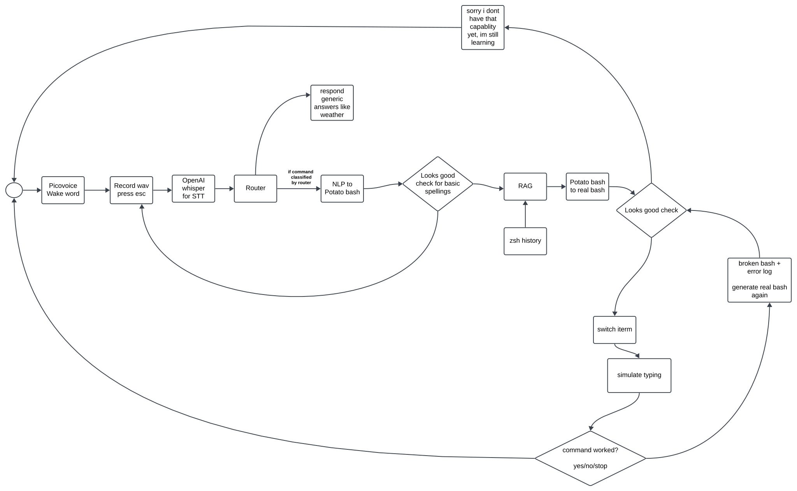
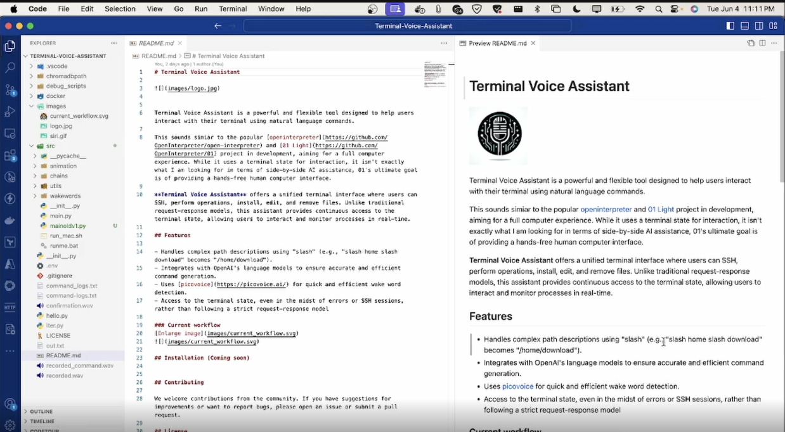

# Terminal Voice Assistant

Terminal Voice Assistant is a powerful and flexible tool designed to help users interact with their terminal using natural language commands. 

This sounds simiar to the popular [openinterpreter](https://github.com/OpenInterpreter/open-interpreter) and [01 Light](https://github.com/OpenInterpreter/01) project in development, aiming for a full computer experience. While it uses a terminal state for interaction, it isn't exactly what I am looking for in terms of side-by-side AI assistance, 01's ultimate goal is of providing a hands-free human computer interface. 

**Terminal Voice Assistant** offers a unified terminal interface where users can SSH, perform operations, install, edit, and remove files. Unlike traditional request-response models, this assistant provides continuous access to the terminal state, allowing users to interact and monitor processes in real-time.

## Features

- Handles complex path descriptions using "slash" (e.g., "slash home slash download" becomes "/home/download").
- Integrates with OpenAI's language models to ensure accurate and efficient command generation.
- Uses [picovoice](https://picovoice.ai/) for quick and efficient wake word detection.
- Access to the terminal state, even in the midst of errors or SSH sessions, rather than following a strict request-response model

### Current workflow
[Enlarge image](images/current_workflow.svg)

## Installation (Coming soon)

## Demo

## Contributing

We welcome contributions from the community. If you have suggestions for improvements or want to report bugs, please open an issue or submit a pull request.

## License

This project is licensed under the MIT License. See the [LICENSE](LICENSE) file for more details.